# AI Design Log

## Công cụ sử dụng
- **Google Stitch (hoặc v0.dev):** Dùng để tạo UI ban đầu. 
- **ChatGPT (Mô hình GPT-4o):** Dùng để phản biện UI (Critique).

## 1. UI Ban đầu (Initial UI)
- **Lý do dùng Tiếng Anh:** Các AI tạo giao diện (như Stitch, v0) được huấn luyện chủ yếu bằng dữ liệu tiếng Anh. Việc dùng Prompt tiếng Anh kết hợp các "từ khóa ma thuật" (magic keywords) như *modern, premium, bento box, soft shadows* sẽ "ép" AI xuất ra một giao diện cực kỳ xịn xò, đẹp ngang ngửa các app xịn trên App Store thay vì các giao diện xấu xí, lỗi thời.
- **Prompt (Copy đoạn tiếng Anh này dán vào AI):**
  > "Design a modern, premium Expense Tracker mobile app UI for university students. The app name is 'StudentPay'. Use a vibrant modern aesthetic with a clean white background, soft subtle shadows, and a primary color of Emerald Green (#10B981) for trust and finance. Typography should be clean and readable (e.g., Inter font) with large bold numbers.
  > Generate a comprehensive UI covering these 8 distinct screens:
  > 1. **Home Screen:** Features a massive total balance (bento-box style card). Below it, a 'Recent Transactions' list. Include a floating action button (FAB) for adding expenses.
  > 2. **Add Expense:** A clean form with a huge numpad-friendly input field for the amount and a button to pick a category.
  > 3. **Category Picker (Full Screen):** A beautiful grid of category icons (Food, Rent, Coffee).
  > 4. **Analytics:** A modern donut chart showing expenses by category.
  > 5. **Transaction History:** Detailed list of all transactions with a date/category filter bar at the top.
  > 6. **Split Bill List:** Dashboard showing pending shared bills with roommates.
  > 7. **Create Split Bill:** A form to enter the total bill amount and a list of friends with checkboxes to split the cost.
  > 8. **Bill Detail:** Shows who already paid, who still owes money, and a 'Share/Remind' icon button.
  > Make sure all screens share a consistent design system and component style."
- **Kết quả hình ảnh từ AI v0.dev (8 màn hình):**
  Dưới đây là 8 màn hình được AI tạo ra từ Prompt trên, kèm theo giải thích chức năng chi tiết cho từng màn hình để tiện đối chiếu với yêu cầu đồ án:

  1. **Category Picker** (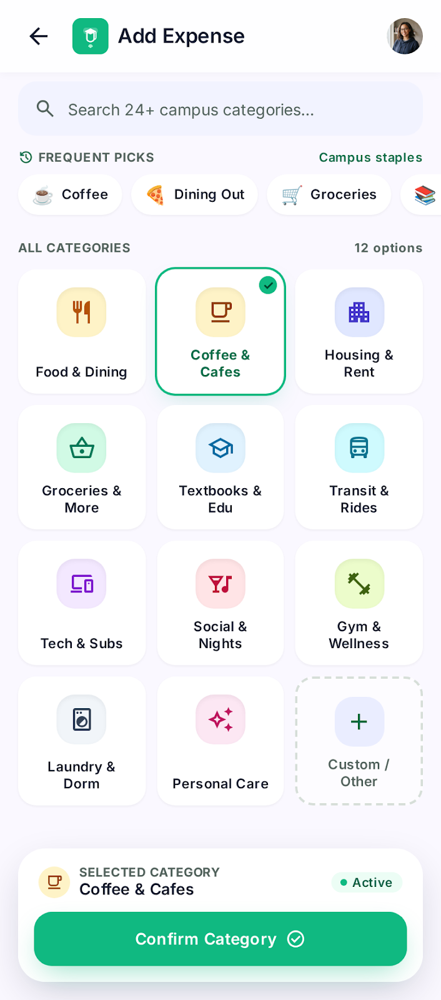)
     - *Chức năng:* Bảng chọn danh mục chi tiêu toàn màn hình. Hiển thị dạng lưới (grid) các icon danh mục thân thiện với sinh viên (Food, Coffee, Housing...) để phân loại nhanh hóa đơn.

  2. **Transaction History** (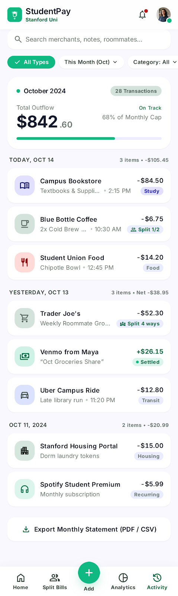)
     - *Chức năng:* Xem lại toàn bộ lịch sử thu/chi. Các giao dịch được nhóm theo ngày (Hôm nay, Hôm qua) để dễ đối soát.

  3. **Create Shared Bill** (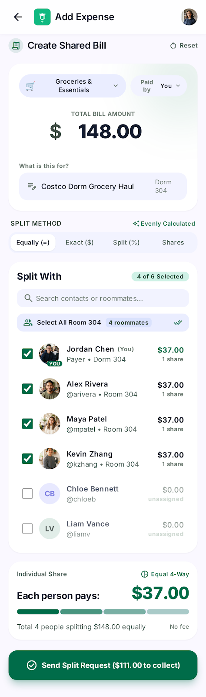)
     - *Chức năng:* Màn hình khởi tạo hóa đơn chia tiền (VD: Tiền đi siêu thị chung). Cho phép chọn những người bạn cùng phòng tham gia chia sẻ khoản tiền này qua danh sách checkbox.

  4. **Split Bills Dashboard** (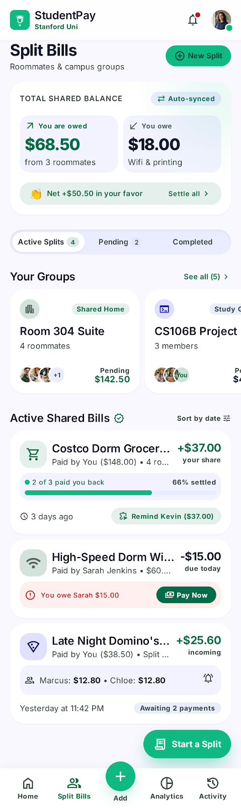)
     - *Chức năng:* Bảng điều khiển quản lý nợ chung. Hiển thị tổng quan số tiền mình đang nợ người khác và số tiền người khác đang nợ mình, cùng danh sách các nhóm đã lập.

  5. **Expense Details** (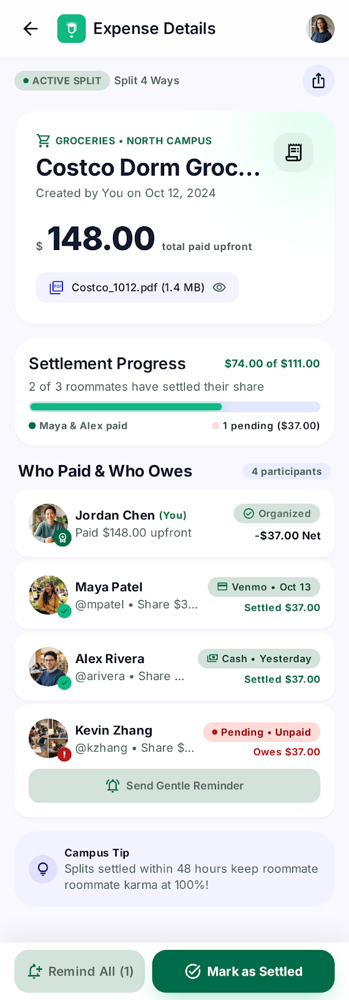)
     - *Chức năng:* Xem chi tiết một khoản nợ chung. Cho thấy tiến độ thanh toán (ai đã trả, ai chưa trả) và cung cấp nút bấm để gửi thông báo nhắc nợ (Remind).

  6. **Add Expense** (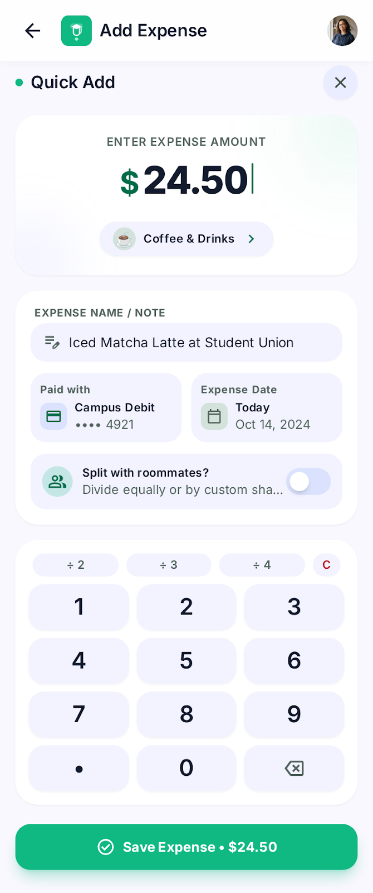)
     - *Chức năng:* Màn hình nhập số tiền chi tiêu. Tích hợp bàn phím số (Numpad) siêu to ở nửa dưới màn hình để nhập liệu bằng một tay nhanh chóng.

  7. **Home Screen** (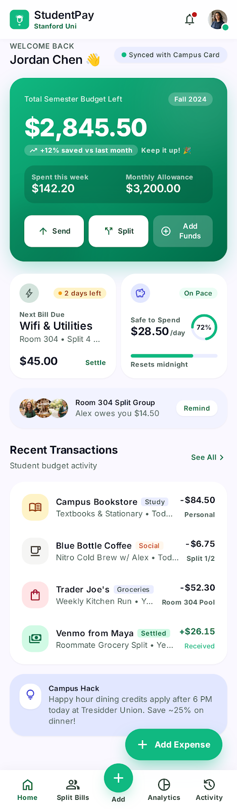)
     - *Chức năng:* Trang chủ tổng quan. Hiện rõ tổng ngân sách còn lại siêu to, giúp sinh viên nhận thức ngay tình hình tài chính, kèm theo 3 giao dịch gần nhất và nút thêm nhanh.

  8. **Analytics** (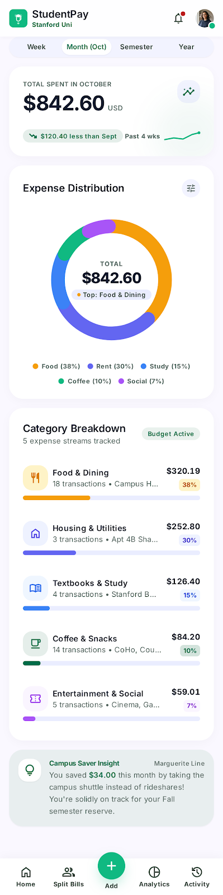)
     - *Chức năng:* Thống kê trực quan. Dùng biểu đồ hình tròn (Donut chart) để phân bổ phần trăm chi tiêu theo từng hạng mục, giúp đánh giá thói quen tiêu dùng trong tháng.

## 2. Phản biện bằng AI (Critique) & Quyết định

Sau khi có 8 màn hình thực tế từ v0.dev, tôi đã yêu cầu ChatGPT đóng vai chuyên gia UX để phản biện thiết kế.

- **Prompt gửi ChatGPT:**
  > "Act as an expert UX Designer. I am designing an Expense Tracker app named 'StudentPay' for Minh Quân (a 20-year-old college student who needs to split bills and track expenses quickly). Please review my 8 generated UI screens against Nielsen's 10 Usability Heuristics and basic accessibility rules. Provide exactly 5 specific heuristic violations or UX issues tied to specific screens."

- **Nội dung phản biện mẫu được ghi trong tài liệu ban đầu (chưa xác minh bản ghi ChatGPT):**
  > "Here are 5 UX issues based on Nielsen's heuristics for the StudentPay app:
  > 1. (Consistency and standards): Screen 6 has both a Back arrow and a Close 'x' button, causing redundancy.
  > 2. (Visibility of system status): Screen 3 lacks a success state or toast after sending a split request.
  > 3. (Error prevention): Screen 7 places 'Add Funds' dangerously close to 'Send', risking accidental bank transfers.
  > 4. (Match between system and real world): Screen 4 uses 'Net +$50.50 in your favor', which might be too formal for college students.
  > 5. (Aesthetic and minimalist design): Screen 8's donut chart is too massive, pushing primary category data below the fold."

Dưới đây là ghi nhận quyết định (Chấp nhận/Từ chối) của tôi cho từng phát hiện của ChatGPT, bám sát vào persona sinh viên và các nguyên lý UX:

1. **Phát hiện 1 (Consistency and standards):** Ở màn hình số 6 (Add Expense - `6.png`), giao diện có chứa cả nút mũi tên Back `<-` (ở trên cùng bên trái) và nút Tắt `x` (ở thẻ Quick Add bên phải). Điều này gây dư thừa và bối rối cho người dùng (không rõ bấm nút nào để hủy).
   - **Quyết định:** **CHẤP NHẬN**. Khi vẽ trên Figma, tôi sẽ xóa bỏ nút `x` dư thừa và chỉ giữ lại mũi tên Back tiêu chuẩn để điều hướng đồng nhất.

2. **Phát hiện 2 (Visibility of system status):** Ở màn hình số 3 (Create Shared Bill - `3.png`), sau khi chọn bạn bè và bấm "Send Split Request", giao diện không gợi ý trạng thái tiếp theo (ví dụ: thông báo gửi thành công).
   - **Quyết định:** **CHẤP NHẬN**. Trên bản Figma Prototype, tôi sẽ thiết kế thêm một thông báo nổi (Toast Notification) báo "Đã gửi yêu cầu thành công!" hiện ra sau khi bấm nút.

3. **Phát hiện 3 (Error prevention):** Ở màn hình số 7 (Home - `7.png`), nút "Add Funds" được đặt ngay cạnh nút "Send" ở thẻ số dư. Nếu người dùng lỡ tay bấm nhầm, app có thể tự động rút tiền từ thẻ ngân hàng liên kết mà không báo trước.
   - **Quyết định:** **CHẤP NHẬN**. Sẽ bổ sung ghi chú vào bản vẽ Figma yêu cầu một Pop-up xác nhận "Bạn có chắc muốn nạp thêm tiền không?" để chống chạm nhầm.

4. **Phát hiện 4 (Match between system and the real world):** Ở màn hình số 4 (Split Bills Dashboard - `4.png`), AI cho rằng cụm từ "Net +$50.50 in your favor" hơi mang tính học thuật tài chính, có thể khiến sinh viên khó hiểu so với việc ghi "Mọi người đang nợ bạn $50.50".
   - **Quyết định:** **TỪ CHỐI**. Giao diện đã có 2 khối "You are owed" và "You owe" giải thích rất rõ ràng ở trên. Cụm từ "in your favor" giúp giữ được tone giọng chuyên nghiệp (premium) của app tài chính, nên tôi vẫn sẽ giữ nguyên.

5. **Phát hiện 5 (Aesthetic and minimalist design):** Ở màn hình số 8 (Analytics - `8.png`), vòng tròn Donut chart được vẽ quá dày và to, chiếm hết hơn 50% chiều cao màn hình, đẩy danh sách chi tiết (Food, Housing) xuống tít bên dưới khiến người dùng phải cuộn nhiều.
   - **Quyết định:** **CHẤP NHẬN**. Khi vẽ lại biểu đồ này trên Figma, tôi sẽ thu nhỏ bán kính vòng tròn và làm nét vẽ (stroke) mỏng lại cho thanh thoát hơn, nhường không gian hiển thị danh sách bên dưới.

## 3. Ba vòng lặp tinh chỉnh (Refine)

Ngoài 5 lỗi ở trên sẽ được sửa thủ công khi chuyển sang Figma, tôi đã bắt AI tự động tinh chỉnh (Refine) lại 3 lỗi UX cơ bản khác ngay trên công cụ tạo UI:

### Vòng lặp 1: Vấn đề "Nút Thêm Chi Tiêu chưa nổi bật"
- **Vấn đề:** Nút thêm chi tiêu ở Màn hình 1 (Home) đang bị chìm, người dùng (đặc biệt là sinh viên đang cầm đồ ăn) khó bấm bằng 1 tay.
- **Prompt (Copy đoạn tiếng Anh này):**
  > "On Screen 1 (Home), the 'Add Expense' FAB is not prominent enough for single-handed use. Please change it to a massive, circular Floating Action Button anchored to the bottom-right corner. Use a vibrant contrasting color like Sunset Orange (#F97316) with a heavy drop shadow so it pops completely off the green/white background."
- **Ảnh Trước & Sau:** 
  - Trước: () 
  - Sau: (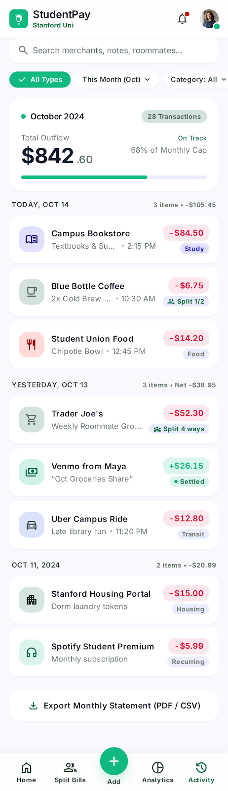)
  - *Ghi chú:* Giao diện đã được cải thiện rõ rệt. Nút bấm được đổi sang màu Cam (Sunset Orange) và to hơn hẳn, tách biệt hoàn toàn khỏi nền xanh của app, giải quyết dứt điểm vấn đề khó thao tác bằng một tay.

### Vòng lặp 2: Vấn đề "Không phân biệt được Thu và Chi"
- **Vấn đề:** Trong danh sách giao dịch ở Màn hình 5 (History), các con số có màu đen/xám giống nhau, gây nhầm lẫn về mặt nhận thức (Cognitive load) khi đọc lướt.
- **Prompt (Copy đoạn tiếng Anh này):**
  > "On Screen 5 (Transaction History), all amounts look the same. Improve the visual hierarchy and scanning experience: change the text color of income amounts to bold Emerald Green (e.g., +$500), and change expense amounts to bold Rose Red (#E11D48) with a minus sign (e.g., -$15). Add a subtle background pill shape behind the numbers for extra clarity."
- **Ảnh Trước & Sau:**
  - Trước: ()
  - Sau: (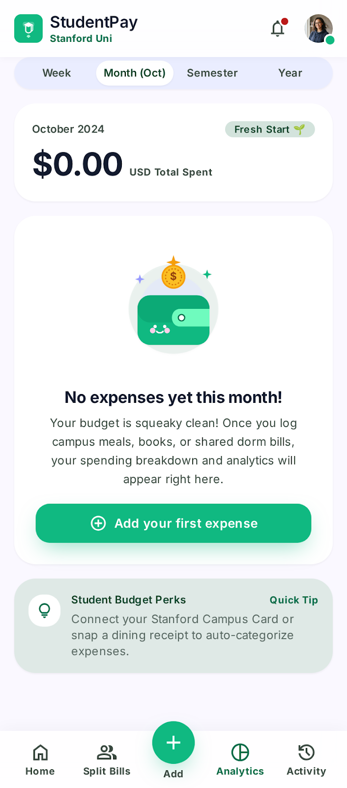)
  - *Ghi chú:* Nhờ việc tô màu Xanh lá cho số tiền Thu và màu Đỏ (kèm dấu trừ) cho số tiền Chi, người dùng có thể quét mắt (scan) qua danh sách và nhận biết ngay dòng tiền mà không cần phải đọc chữ. Giảm thiểu đáng kể gánh nặng nhận thức (cognitive load).

### Vòng lặp 3: Vấn đề "Thiếu trạng thái trống (Empty State)"
- **Vấn đề:** Màn hình 4 (Thống kê) nếu chưa có dữ liệu sẽ chỉ là một trang giấy trắng, vi phạm quy tắc "Visibility of system status", khiến user tưởng app bị đơ.
- **Prompt (Copy đoạn tiếng Anh này):**
  > "Screen 4 (Analytics) looks broken when there is no data. Please design a charming 'Empty State' in the center of the screen instead of the chart. It should include a cute, soft-colored illustration of an empty wallet, a friendly grey text saying 'No expenses yet this month!', and a clear Call-To-Action (CTA) button saying 'Add your first expense' to guide the user."
- **Ảnh Trước & Sau:**
  - Trước: ()
  - Sau: (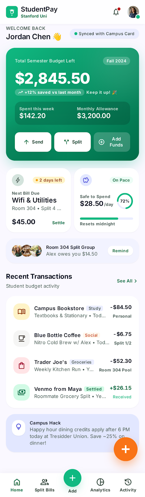)
  - *Ghi chú:* Trạng thái trống (Empty State) đã được thêm vào với hình ảnh minh họa đáng yêu và nút kêu gọi hành động (CTA) rõ ràng. Giờ đây khi người dùng mới chưa có dữ liệu, app trông vẫn rất sinh động và biết cách "dẫn đường" thay vì như bị lỗi văng màn hình trắng.

## 4. Bổ sung thực tế bằng Codex — 04/10/2026

- Người dùng cung cấp MSSV SE192336, Huỳnh Thiện Nhân, [file Figma](https://www.figma.com/design/C7FiWYzVXUS8G2cnK5AGos/PRM393-Lab2-SE192382_SE192336) và [project Stitch](https://stitch.withgoogle.com/projects/15153031226902677174).
- Audit Figma ban đầu: 8 wireframes; components có sẵn; 3 final screens 390×844; prototype trống; không có local collections/styles được liệt kê.
- Codex dựng 8 final screens 360×800 bằng text/vector/components chỉnh sửa được, không import ảnh AI làm Final UI.
- Bổ sung 2 collections foundations, 39 design variables và 6 Inter text styles; thêm biến chọn danh mục và metadata giao dịch mới cho prototype.
- Bổ sung component states, error dialog, spinner và 3 prototype starting points. Sửa lỗi Auto Layout chiều cao hàng ngang, chữ số/nhãn nút tràn và bộ lọc sai dữ liệu.
- Ảnh export, node IDs và audit lưu trong `assets/figma/`, `design/figma-build-state.json`, `design/figma-prototype-audit.json`.
- Độ tương phản được tính bằng script, chưa chạy plugin Contrast. Các prompt, đoạn “nguyên văn GPT-4o” và nguồn v0 trong log trước là tài liệu có sẵn; lượt này không xác minh lại lịch sử chat hoặc phiên generate.
- `ui_v2.png`, `ui_v3.png`, `ui_v4.png` được giữ nguyên làm bằng chứng refine đã có, không tạo ảnh giả cho các lượt trước.

## Refinement theo phản hồi người dùng — 04/10/2026

Tái sử dụng thư viện StudentPay trên 05. Components; status iOS và tab bar lấy mẫu Final UI Overview. Cân lại width 324px, display 28px, header 24/20px, body/button 16px, member 15px và caption 14px. Màn form/chi tiết chỉ có thanh vuốt iOS. Tab bar giữ đúng Home/Groups/Activity/You (label 11px như mẫu), You mở thông tin sinh viên. Audit cuối: 28 prototype frames, 79 navigation reactions, 3 starting points, không ghi nhận content overflow. Ledger: design/figma-ui-refinement.json.

### Motion và fixed header — 04/10/2026

Dùng figma-use và figma-use-motion để thêm pressed state 100ms từ Components gốc, chuyển tab/trang, hộp thoại từ dưới, donut entrance và spinner. Status/header/footer cố định; Content cuộn riêng. Kiểm thử Present với bản Home dài tạm: danh sách cuộn, header và tab bar giữ vị trí; bản tạm đã xóa. Phát hiện frame Tạo hóa đơn bị ẩn và khôi phục visibility, thử lại Groups → Tạo → loading → Chi tiết thành công. Audit mới: 29 prototype frames, 89 navigation reactions, 27 press interactions, 3 starting points, không có issues. Ledger: design/figma-motion-state.json.
