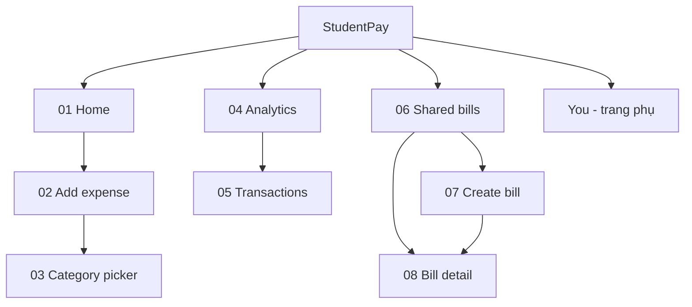
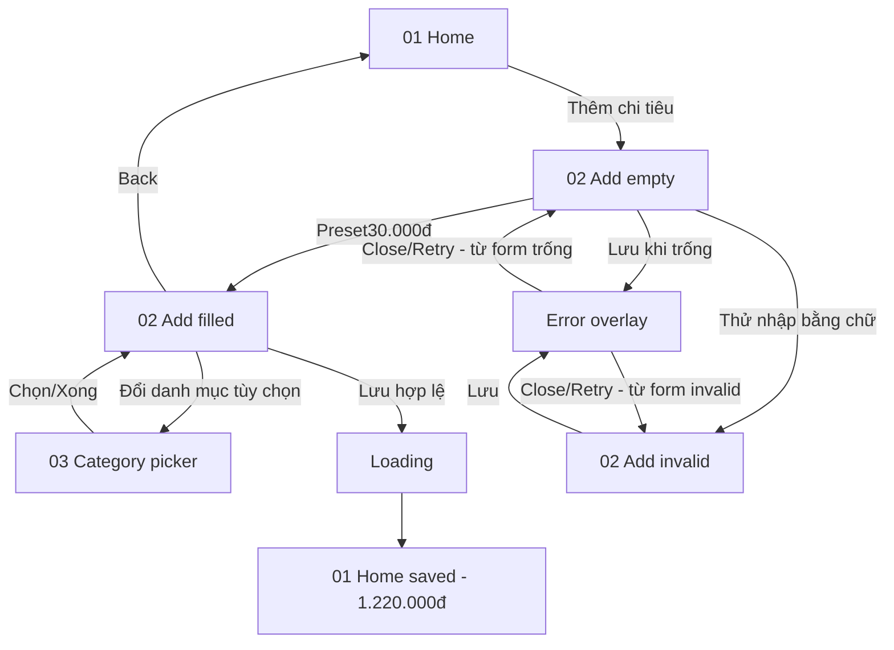
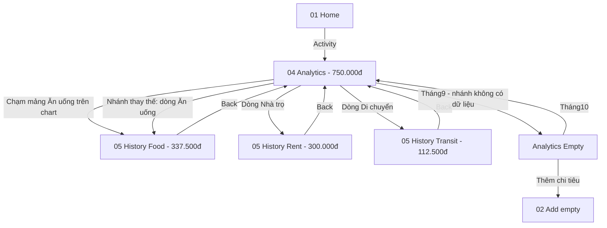
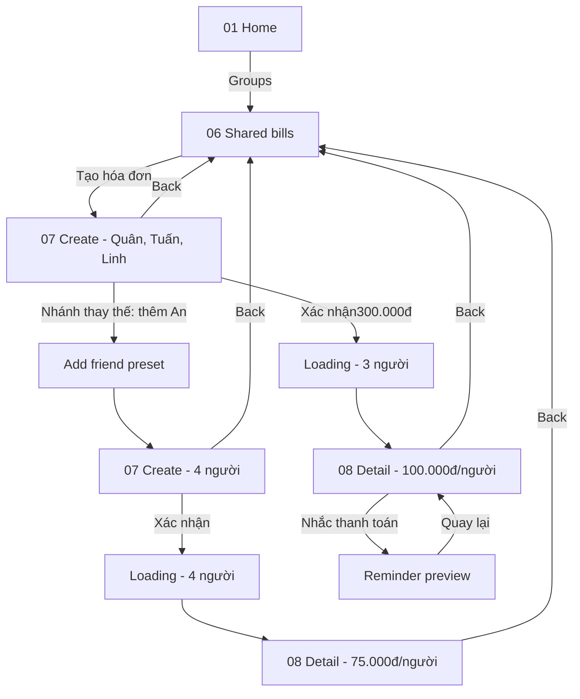

# User flows — StudentPay

## Kiến trúc thông tin

Có 8 màn hình nghiệp vụ. Home, Activity và Groups là ba khu vực chính; tab You là trang thông tin phụ. Dialog/state variants không tính thêm thành màn hình.

## Flow 1 — Ghi khoản chi và phục hồi lỗi

Start: Home. Goal: ghi khoản chi 30.000đ. End: Home có kết quả lưu và số dư 1.220.000đ. Prototype dùng preset, không có bàn phím nhập tự do.

Ngày 09/10 đã đổi Saveerror sang OVERLAY; Retry/scrim CLOSE vềform gốc. Source scripts04/10 là lịch sử trước thay đổi. GraphAPI xác nhận liên kết, còn chạyPresent. Category hiện trả về form preset; không coi là chứng minh giữ dữ liệu nhập tự do.

## Flow 2 — Xem chi tiêu theo danh mục

Start nghiệp vụ: Home. Starting point prototype riêng: Analytics. Goal: xem giao dịch Ăn uống. End: Transactions có tổng 337.500đ; Back về Analytics.

Chart có dòng danh mục bằng chữ/số tiền để người dùng không chỉ dựa vào màu hoặc vùng chạm nhỏ.

## Flow 3 — Tạo hóa đơn, chia 3 hoặc 4 người

Start nghiệp vụ: Home. Starting point prototype riêng: Groups. Goal: tạo hóa đơn 300.000đ. End: Bill detail với phần chia đúng số thành viên.

Ba người gồm người trả trước Quân và hai bạn Tuấn/Linh. Reminder chỉ xem trước, không gửi tin nhắn thật. Flow dữ liệu độc lập với luồng expense/analytics.

## Ánh xạ flow–screen

| Flow | Màn hình chính | Nhánh/phản hồi |
|---|---|---|
| 1 | 01 Home, 02 Add, 03 Category | Empty/filled/invalid, Error/Retry, Loading, Home saved |
| 2 | 01 Home, 04 Analytics, 05 Transactions | Chart hoặc dòng danh mục, bộ lọcFood/Rent/Transit, Back |
| 3 | 01 Home, 06 Shared bills, 07 Create, 08 Detail | Thêm An, chia 3/4, Loading, Reminder preview, Back |

Đây là đối chiếu source/audit lưu, chưa chạy lại Present trong lượt này. Các yêu cầu nhập tự do, validate mọi giá trị và dữ liệu đồng bộ thuộc triển khai tương lai trong handoff.
