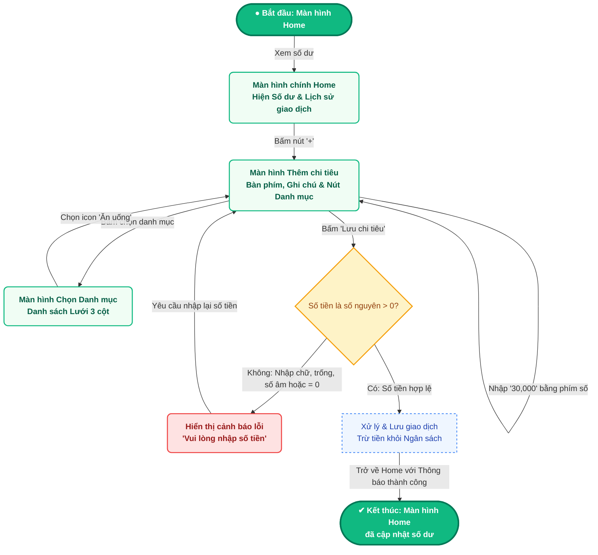
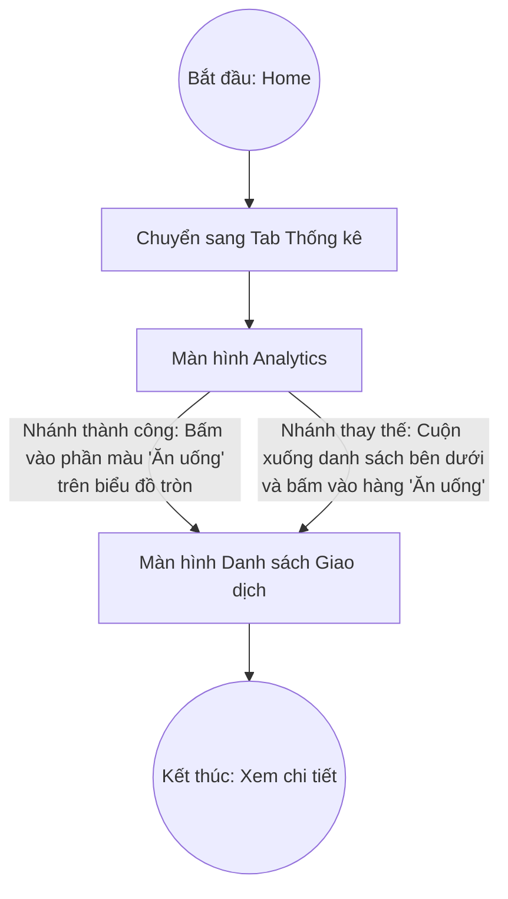
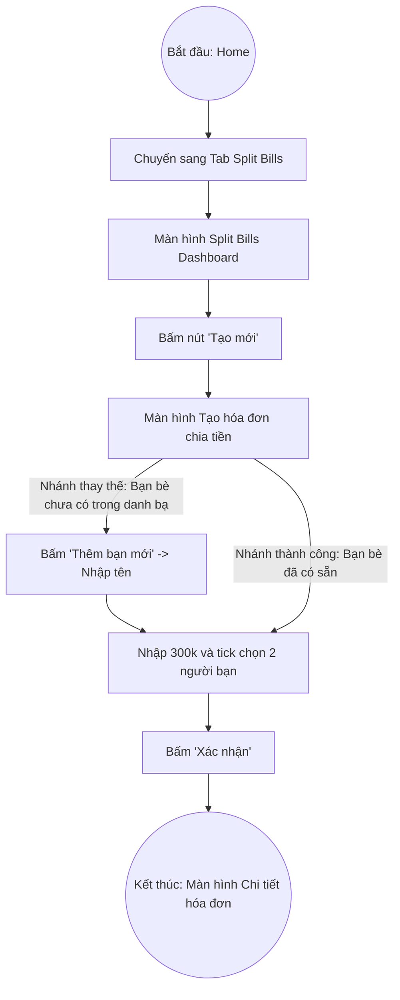

# Phân tích UX - User Flow

## 1. Information Architecture (Kiến trúc thông tin)
- **Cấp 1 (Màn hình chính - Truy cập qua Navigation Bar đáy):**
  1. Màn hình Home (Tổng quan)
  2. Màn hình Thống kê (Analytics)
  3. Màn hình Danh sách Chia tiền (Split Bill Dashboard)
- **Cấp 2 (Màn hình phụ lồng bên trong):**
  4. Màn hình Thêm chi tiêu (truy cập từ Home)
  5. Màn hình Danh sách Giao dịch chi tiết (truy cập từ Thống kê)
  6. Màn hình Tạo hóa đơn chia tiền (truy cập từ Split Bill)
  7. Màn hình Chi tiết hóa đơn (truy cập từ Split Bill hoặc sau khi Tạo xong hóa đơn)
- **Cấp 3 (Màn hình con):**
  8. Màn hình Chọn Danh mục (truy cập từ Thêm chi tiêu)

*(Lưu ý: 8 màn hình ở đây sẽ tương ứng chính xác với 8 bản vẽ thiết kế UI ở các giai đoạn sau)*

## 2. User Flows (Sơ đồ luồng người dùng)

### Flow 1: Thêm khoản chi tiêu mới (Có nhánh lỗi - Error Path)
- **Điểm bắt đầu:** Màn hình Home.
- **Mục tiêu:** Ghi lại một khoản tiền ăn trưa (30,000 VND).
- **Điểm kết thúc:** Màn hình Home (cập nhật số dư mới).

### Flow 2: Xem thống kê chi tiêu tháng (Có nhánh thay thế - Alternative Path)
- **Điểm bắt đầu:** Màn hình Home.
- **Mục tiêu:** Kiểm tra chi tiết các giao dịch thuộc danh mục "Ăn uống" trong tháng.
- **Điểm kết thúc:** Màn hình Danh sách Giao dịch chi tiết.

### Flow 3: Tạo hóa đơn chia tiền (Có nhánh thay thế - Alternative Path)
- **Điểm bắt đầu:** Màn hình Home.
- **Mục tiêu:** Tạo hóa đơn đi siêu thị chung (300k) và chia tiền cho 2 người bạn.
- **Điểm kết thúc:** Màn hình Chi tiết hóa đơn (Bill Detail).

## 3. Bảng ánh xạ Flow sang Màn hình

Bảng dưới đây đảm bảo cả 8 màn hình trong Information Architecture đều được đi qua ít nhất một lần.

| User Flow | Các màn hình được sử dụng |
| :--- | :--- |
| **Flow 1** | 01. Home, 02. Thêm chi tiêu, 03. Chọn Danh mục |
| **Flow 2** | 01. Home, 04. Thống kê, 05. Danh sách Giao dịch chi tiết |
| **Flow 3** | 01. Home, 06. Split Bill Dashboard, 07. Tạo hóa đơn, 08. Chi tiết hóa đơn |

## Quy ước bản final 04/10/2026

Số 01–08 theo `design/screen-spec.md`. Đường nhanh dùng danh mục/ngày mặc định: Thêm → preset 30.000đ → Lưu, không bắt buộc mở Category Picker. Nhánh lỗi nhập bằng chữ được thể hiện trong Prototype / Add invalid và Amount error dialog. Chia 3 người gồm Quân (người trả trước), Tuấn và Linh.
